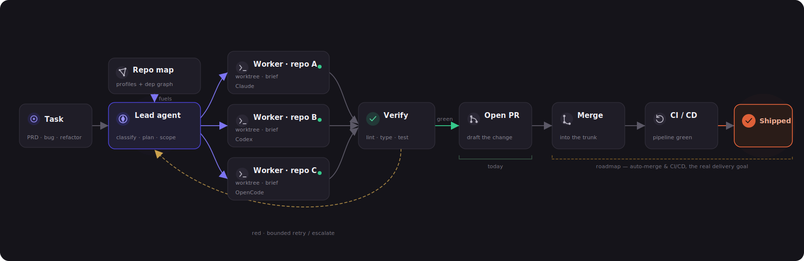
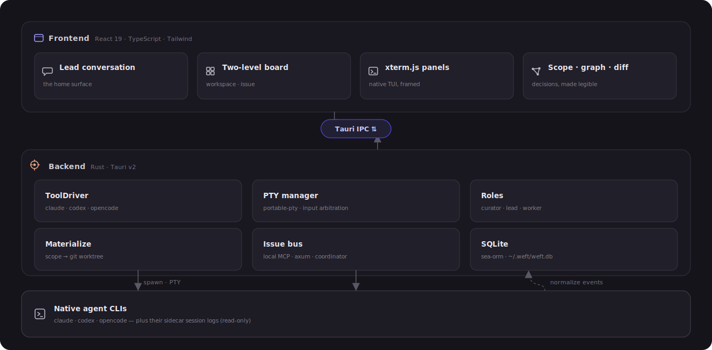
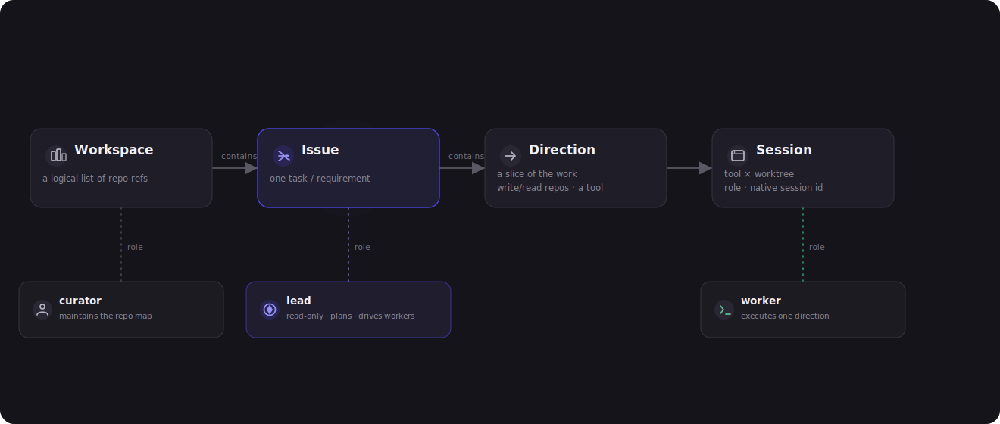

<div align="center">


### Local-first delivery hub for coding agents

Give Weft one task. It plans the scope, starts your native coding-agent CLIs, coordinates isolated worktrees, and turns multi-repo work into reviewable code.

**local-first · no server · native CLIs · automation-first**

[简体中文](README.zh-CN.md) · **English**

<<<<<<< Updated upstream
<sub>Tauri v2 · React 19 · Rust · SQLite · xterm.js</sub>
||||||| Stash base
<sub>Tauri v2 · React 19 · Rust · SQLite</sub>
=======
<sub>Tauri v2 · React 19 · Rust · SQLite · git worktree</sub>
>>>>>>> Stashed changes

</div>

---

<p align="center">
  
  <br><sub><i>The workspace board shows active issues, progress, failing checks, and everything that needs human attention.</i></sub>
</p>

## What Weft Is

Weft is a desktop app for local, multi-repository software delivery. Instead of treating an agent chat as the unit of work, Weft treats a **Task** as the unit of work: a bug, PRD, refactor, spike, or link that may touch several repositories.

The current product boundary is **Task → reviewable local worktree diff with executable checks**. Opening PRs, observing CI, merge orchestration, and staging/production deployment are roadmap work. Weft is not a CI/CD replacement; it is designed to drive and observe the pipelines your repositories already have.

## How It Works

<<<<<<< Updated upstream
A workspace is a logical set of repository references. One **Task** is decomposed
into parallel **directions**. Each direction runs in its own isolated git
worktree, driven by a worker agent, and all directions converge toward a
reviewable result. Today the result is a PR per repository; the roadmap extends
that flow through merge and environment-aware deployment.

||||||| Stash base
A workspace is a logical set of repository references. One **Task** is decomposed
into parallel **directions**. In the current implementation, each direction owns
exactly one write repository and gets one isolated git worktree; reads are free
and do not need to be declared. The directions converge toward a reviewable
worktree diff with executable checks. Opening PRs is the next delivery boundary;
the longer roadmap extends that flow through merge and environment-aware
deployment.

=======
>>>>>>> Stashed changes
<p align="center">
  
</p>

1. **Curator** profiles repositories and builds a dependency map.
2. **Lead** reads across the workspace, proposes scope, and breaks the task into directions.
3. **Workers** execute directions in isolated git worktrees, one write repository per direction.
4. **Checks** run against changed worktrees; failures and permission requests surface in **Needs you**.

Weft runs `claude`, `codex`, and `opencode` as native binaries. It drives them through structured JSON/headless modes, keeps their hooks and permissions intact, and renders its own timeline instead of embedding a terminal.

## Product Surfaces

| Workspace board | Issue board |
|---|---|
|  |  |

<<<<<<< Updated upstream
<p align="center">
  
  <br><sub><i>The curator's cross-repo dependency map: repository roles, stacks, and relationships such as "core · N dependents". This is the input for scope decomposition.</i></sub>
</p>

---

## Core Model

Weft is organized around four nested layers. Sessions carry an explicit role, so
planning, coordination, and implementation stay separate.

<p align="center">
  
</p>

<p align="center">
  
  <br><sub><i>Home is the Lead conversation. The Lead reads across repositories, plans the work, and drives workers. Board / Lead tabs switch between the live board and the coordinating conversation.</i></sub>
</p>

- **Curator** profiles each repository with its role, interfaces, and stack, then
  builds the cross-repo dependency map used for decomposition.
- **Lead** is the main conversation and control tower. It reads repositories,
  derives scope, starts workers, and coordinates them over a thread bus. **It
  never writes code and never consumes raw worker transcripts**; workers report
  structured summaries and diff stats.
- **Worker** executes one direction in its own worktree from a structured
  **brief** containing scope, interface contracts, and acceptance criteria.

---

## Board As Trust Surface

Because Weft does not put a human gate in front of every step, the board is not a
manual to-do list. It is a live projection of agent state, git state, and check
state. Cards move through the lifecycle automatically; you act on the exceptions
that surface.

The board has two levels:

- **Workspace board**: one card per **thread**, giving a portfolio view of the
  workspace. Cards show task kind, direction count, running work, failing checks,
  and whether anything **Needs you**.
- **Thread board**: one card per **direction / task**, focused on a single line
  of work. The **Board ↔ Lead** tabs switch between the cards and the Lead
  conversation.

<p align="center">
  
</p>

<p align="center">
  
  <br><sub><i>A thread board: directions move through the lifecycle, each tagged with its tool and live status. An open ask or failing check moves a card into <b>Needs you</b>.</i></sub>
</p>

- **Needs you is the exception lane.** Any open permission request or failing
  check is surfaced there, regardless of the task's stored status. It is
  aggregated across threads and shown at the top of every view.
- **Cards carry evidence.** Running sessions, failing checks, and verification
  provenance are expandable. Green should be trustworthy; red should be
  actionable.
- **The human acts, not babysits.** The main verbs are Approve, Answer, Open,
  and Review. Manual drag-to-status remains available when you want to override
  what the agents inferred.

---

## Product Principles

1. **Automation is the direction.** The default path is autonomous: task in,
   deliverable code out. Interfaces are built for supervising the flow, not
   pushing every step.
2. **Humans handle exceptions, not the assembly line.** Weft adds no approval
   gate of its own. Blocking prompts come from the native tools or from a
   configurable irreversible-action boundary such as protected-branch merge or
   production deployment.
3. **Run native CLIs, do not redraw them.** Weft starts `claude`, `codex`, and
   `opencode` as normal binaries under the user's own configuration, preserving
   hooks, skills, and permissions. Native TUIs run in a PTY; Weft hosts and
   coordinates them.
4. **Keep cross-repo wiring temporary.** Sibling repositories are mounted
   read-only through launch arguments such as `--add-dir`; Weft does not write
   that wiring into a canonical repository's config.
5. **Hide mechanisms, show decisions.** Worktrees, PTYs, the MCP bus, and
   sidecars live under **Inspect**. Task, scope, branch, PR, diff, tool choice,
   and brief stay first-class.
6. **Bilingual from the start.** UI text and agent-output language are both
   language-aware. Internal state enums stay English; code and identifiers stay
   English.

---
||||||| Stash base
<p align="center">
  
  <br><sub><i>The curator's cross-repo dependency map: repository roles, stacks, and relationships such as "core · N dependents". This is the input for scope decomposition.</i></sub>
</p>

---

## Core Model

Weft is organized around four nested layers. Sessions carry an explicit role, so
planning, coordination, and implementation stay separate.

<p align="center">
  
</p>

<p align="center">
  
  <br><sub><i>Home is the Lead conversation. The Lead reads across repositories, plans the work, and drives workers. Board / Lead tabs switch between the live board and the coordinating conversation.</i></sub>
</p>

- **Curator** profiles each repository with its role, interfaces, and stack, then
  builds the cross-repo dependency map used for decomposition.
- **Lead** is the main conversation and control tower. It reads repositories,
  derives scope, starts workers, and coordinates them over a thread bus. **It
  never writes code and never consumes raw worker transcripts**; workers report
  structured summaries and diff stats.
- **Worker** executes one direction in its own worktree from a structured
  **brief** containing scope, interface contracts, and acceptance criteria.

---

## Board As Trust Surface

Because Weft does not put a human gate in front of every step, the board is not a
manual to-do list. It is a live projection of agent state, git state, and check
state. Cards move through the lifecycle automatically; you act on the exceptions
that surface.

The board has two levels:

- **Workspace board**: one card per **thread**, giving a portfolio view of the
  workspace. Cards show task kind, direction count, running work, failing checks,
  and whether anything **Needs you**.
- **Thread board**: one card per **direction / task**, focused on a single line
  of work. The **Board ↔ Lead** tabs switch between the cards and the Lead
  conversation.

<p align="center">
  
</p>

<p align="center">
  
  <br><sub><i>A thread board: directions move through the lifecycle, each tagged with its tool and live status. An open ask or failing check moves a card into <b>Needs you</b>.</i></sub>
</p>

- **Needs you is the exception lane.** Any open permission request or failing
  check is surfaced there, regardless of the task's stored status. It is
  aggregated across threads and shown at the top of every view.
- **Cards carry evidence.** Running sessions, failing checks, and verification
  provenance are expandable. Green should be trustworthy; red should be
  actionable.
- **The human acts, not babysits.** The main verbs are Approve, Answer, Open,
  and Review. Manual drag-to-status remains available when you want to override
  what the agents inferred.

---

## Product Principles

1. **Automation is the direction.** The default path is autonomous: task in,
   deliverable code out. Interfaces are built for supervising the flow, not
   pushing every step.
2. **Humans handle exceptions, not the assembly line.** Weft adds no approval
   gate of its own. Blocking prompts come from the native tools or from a
   configurable irreversible-action boundary such as protected-branch merge or
   production deployment.
3. **Run native CLIs, render the conversation yourself.** Weft starts `claude`,
   `codex`, and `opencode` as normal binaries under the user's own
   configuration, preserving hooks, skills, and permissions. Each CLI is driven
   headless through its structured JSON stream, and Weft renders its own
   conversation UI; any session can be taken over in your own terminal at any
   time.
4. **Keep cross-repo wiring temporary.** Sibling repositories are mounted
   read-only through launch arguments such as `--add-dir`; Weft does not write
   that wiring into a canonical repository's config.
5. **Hide mechanisms, show decisions.** Worktrees, headless agent processes,
   the MCP bus, and sidecars live under **Inspect**. Task, scope, branch, PR,
   diff, tool choice, and brief stay first-class.
6. **Bilingual from the start.** UI text and agent-output language are both
   language-aware. Internal state enums stay English; code and identifiers stay
   English.

---
=======
| Lead conversation | Repository map |
|---|---|
|  |  |
>>>>>>> Stashed changes

## Architecture

<p align="center">
  
</p>

<<<<<<< Updated upstream
**Locked stack**: Tauri v2 (Rust + React / TypeScript / Vite) ·
`portable-pty` + `xterm.js` · SQLite (sea-orm) · system `git worktree` ·
`react-i18next`.
||||||| Stash base
**Locked stack**: Tauri v2 (Rust + React / TypeScript / Vite) · headless chat
engine over the CLIs' native JSON streams · SQLite (sea-orm) · system
`git worktree` · `react-i18next`.
=======
The stack is intentionally local:
>>>>>>> Stashed changes

- **Frontend:** React, TypeScript, Vite, Tailwind, i18next.
- **Backend:** Tauri v2, Rust, SeaORM migrations, SQLite at `~/.weft/weft.db`.
- **Agents:** Claude Code as resident stream-json sessions; Codex and OpenCode as per-turn JSON processes.
- **Isolation:** system `git worktree` with namespaced branches.
- **Observation:** sidecars read native session logs and normalize events; no second writer takes over a native session.

<p align="center">
  
</p>

## Current Capabilities

- Workspace, repository, issue/thread, direction, session, worktree, and message persistence.
- Repo add / clone / create, deterministic repo profiles, and dependency graph visualization.
- Lead chat backed by Claude stream-json and planner tools.
- Chat-mode workers for Claude, Codex, and OpenCode through one engine.
- Resume, interrupt, terminal takeover, Codex app links, attachments, slash discovery, streaming activity rows.
- Scope review, write-trigger approval, lazy worktree materialization, and one write repo per direction.
- Ask Bridge, Needs-you aggregation, thread bus, sidecar observe events, diff views, and inferred checks for common stacks.
- zh/en UI plus agent-output language preference.

## Getting Started

Prerequisites: Node.js 18+, Rust, Tauri v2 platform dependencies, system `git`, and at least one supported coding-agent CLI if you want live agent sessions.

```bash
npm install
npm run tauri dev
```

Useful commands:

```bash
npm run dev              # frontend-only Vite server
npm run build            # TypeScript check + production frontend build
npm run tauri build      # desktop release bundle
cd src-tauri && cargo test
```

## Project Layout

```text
src/                  React frontend
<<<<<<< Updated upstream
  board/              two-level board, repo graph, scope confirm, Needs you, bus
  session/            Lead tab, transcript, diff views
  panels/             xterm.js terminal panels
  nav/  components/    workspace nav, dialogs, UI primitives, Inspect
  i18n/               en / zh resources and runtime switching
||||||| Stash base
  board/              two-level board, repo graph, write-scope review, Needs you
  session/            chat timeline, composer, observe and diff views
  nav/  components/    workspace nav, dialogs, UI primitives, Inspect
  i18n/               en / zh resources and runtime switching
=======
  board/              workspace/issue boards, repo graph, scope review
  session/            lead and worker timelines, composer, observe, diff
  nav/ components/    shell, settings, command palette, shared UI
  i18n/               English and Chinese resources
>>>>>>> Stashed changes
src-tauri/src/        Rust backend
<<<<<<< Updated upstream
  drivers/            ToolDriver: claude · codex · opencode + sidecar parsing
  pty.rs              PTY sessions and input arbitration
  roles/curator/lead  survey · scope · brief · dispatch · worker mandate
  bus/                thread bus (MCP / axum server) + coordinator injection
  materialize.rs      scope → worktree + add-dir wiring
  store/              SQLite schema and repositories
ARCHITECTURE.md       full design and feasibility study
PRODUCT.md  DESIGN.md product thesis and visual system
||||||| Stash base
  lead_chat/          headless chat engine: claude stream-json (resident),
                      codex exec --json · opencode run --format json (per turn)
  sidecar.rs          native transcript readers → normalized observe events
  ask.rs              Ask Bridge: permission asks → Needs-you cards → decisions back
  planner.rs          Task → proposed directions, one write repo per direction
  curator.rs          deterministic repo profiles + dependency graph
  coordinator.rs      bus wakeups → invisible queued nudges
  brief.rs            worker brief assembled from task, repo graph, mandate
  check.rs            inferred lint/type/build/test/contract checks
  config.rs           effective Claude skills/rules preview
  bus/                thread bus (MCP / axum server) + coordinator nudges
  materialize.rs      confirmed write direction → namespaced git worktree
  store/              SQLite schema, migrations, repositories
ARCHITECTURE.md       full design and feasibility study
PRODUCT.md  DESIGN.md product thesis and visual system
=======
  lead_chat/          headless chat engine and protocol parsing
  store/              SQLite schema, migrations, repositories
  bus/                local thread bus and coordinator nudges
  git.rs              worktree and diff commands
  planner.rs          task scope and direction proposals
  curator.rs          repo profiles and dependency graph
  sidecar.rs ask.rs   observe sidecars and permission bridge
assets/diagrams/      README architecture and model diagrams
assets/screenshots/   README product screenshots
>>>>>>> Stashed changes
```

## Design Boundaries

- Do not add embedded terminal or TUI dependencies. Terminal takeover is an escape hatch, not the product surface.
- Do not write cross-repo wiring into canonical repositories. Use temporary launch flags, worktree-local ignored files, or Weft-managed state.
- Keep user-facing text in i18n resources. Internal enums and code identifiers stay English.

<<<<<<< Updated upstream
Weft is in **active development**. The vertical slices in
[`CLAUDE.md`](CLAUDE.md) are implemented or in progress: single-tool
end-to-end (M1), worktree orchestration and data model (M2), three drivers and
surfaces (M3), session interaction layer (M4), Lead / Worker with lazy scope
(M5), and the two-level agent-first board with config delivery and i18n (M6).
The current focus is simplifying scope into a label-free, lazy-materialized
model.

**Roadmap boundary.** Today, delivery stops at a PR per affected repository. The
longer-term target is to continue through auto-merge and environment-aware
deployment, so "done" means shipped code rather than an open PR. That is the
roadmap, not the current behavior.

For deeper context, see [`ARCHITECTURE.md`](ARCHITECTURE.md), [`PRODUCT.md`](PRODUCT.md),
and [`DESIGN.md`](DESIGN.md).

---

<div align="center">
<sub>Composed, exact, quietly alive. — Weft</sub>
</div>
||||||| Stash base
Weft is in **active development**. The current codebase implements the core
local app shell and a substantial vertical slice:

- Tauri v2 + React 19 + SQLite via SeaORM migrations.
- Workspace / repo / thread / direction / worktree / session / lead-message
  persistence, including repo clone/create/add and cascade cleanup.
- Deterministic repo profiling and a cross-repo dependency graph from manifests.
- A lead conversation backed by Claude stream-json plus planner MCP tools.
- Chat-mode workers for Claude, Codex, and OpenCode through one chat engine:
  Claude is resident; Codex and OpenCode are per-turn processes.
- Worker resume, interrupt, terminal takeover commands, Codex app links, file
  attachments, image handling, slash-command discovery, streaming deltas, and
  transient activity rows.
- Planner proposals where each direction declares one write repo with a reason
  and mandate (`plan+impl` or `impl-only`); pending write declarations surface in
  Needs-you and materialize only when approved or confirmed.
- Ask Bridge for tool permissions through generated hooks/plugins, with
  Allow / Deny / Always / Full plus global Dangerous mode.
- Thread bus over a local MCP/HTTP server, human asks, shared state, interface
  broadcasts, and coordinator wakeups that queue invisible nudges.
- Sidecar transcript readers for Claude jsonl, Codex rollout jsonl, and
  OpenCode SQLite, normalized into Observe events.
- Inferred verification rungs for Node, Rust, Go, Python, and buf contracts;
  auto-checks run when workers settle, and review runs as the configured skill
  inside the worker conversation.
- Two-level board, repo map, Lead tab, worker session view, Observe/Diff panels,
  Needs-you surface, settings, onboarding, command palette, light/dark theme, and
  zh/en UI plus agent-output language preference.
- Runaway guardrails: wall-clock and idle caps force-stop stuck turns and raise
  a Needs-you question; defaults are configurable in Settings and via `WEFT_*`
  environment variables.

Still not implemented as product behavior: automated PR creation, protected
branch merge, staging/production deployment orchestration, team marketplace
sync, a long-lived semantic curator agent, and full CI/CD observation.

**Roadmap boundary.** Current code reaches reviewable local worktree diffs with
pre-PR checks. The product boundary is Task → PR next; the longer-term target is
to continue through auto-merge and environment-aware deployment, so "done" means
shipped code rather than an open PR.

For deeper context, see [`ARCHITECTURE.md`](ARCHITECTURE.md), [`PRODUCT.md`](PRODUCT.md),
and [`DESIGN.md`](DESIGN.md).

---

<div align="center">
<sub>Composed, exact, quietly alive. — Weft</sub>
</div>
=======
More detail: [`ARCHITECTURE.md`](ARCHITECTURE.md), [`PRODUCT.md`](PRODUCT.md), [`DESIGN.md`](DESIGN.md), and [`AGENTS.md`](AGENTS.md).
>>>>>>> Stashed changes
