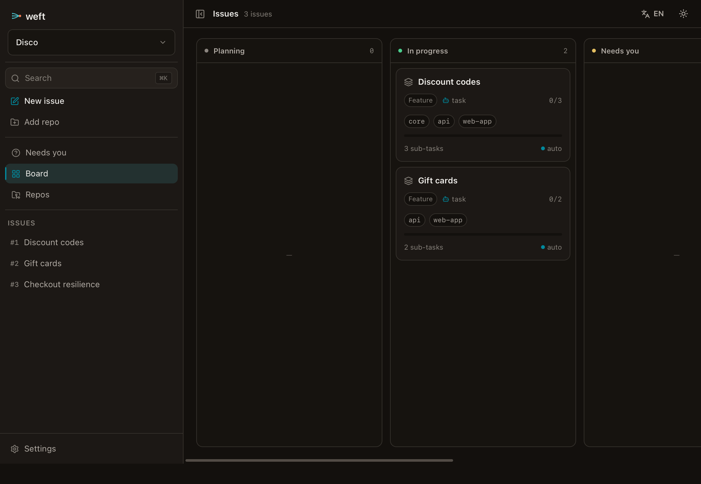
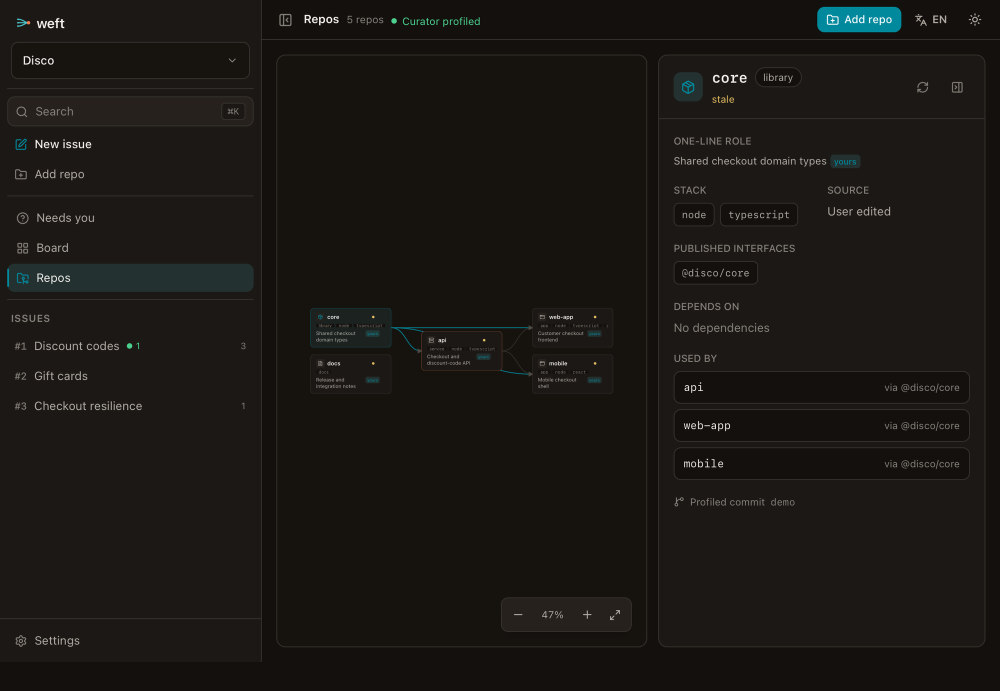
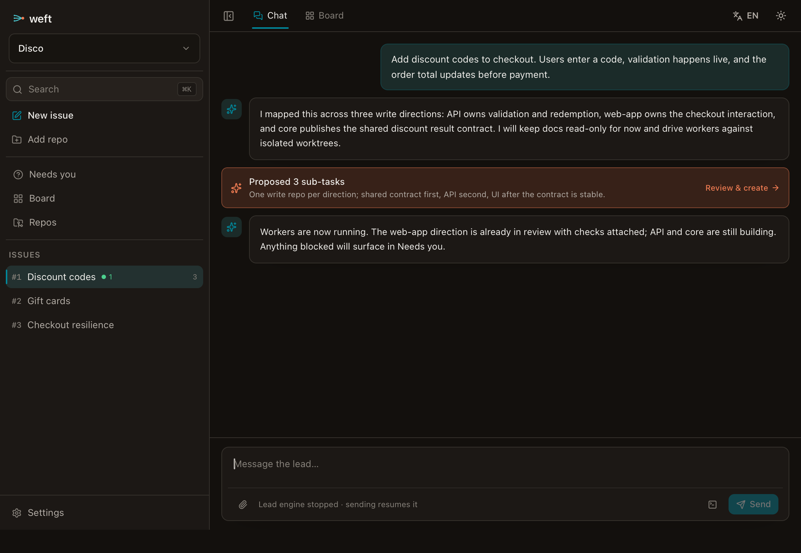

<div align="center">


### 面向 coding agent 的本地优先交付中枢

把一个任务交给 Weft。它会调度你自己的 Claude Code、Codex 和 OpenCode，跨多个仓库协同推进，直到产出可评审、可合入的代码。

**本地优先 · 无服务端 · 自动化优先**

**简体中文** · [English](README.md)

<sub>Tauri v2 · React 19 · Rust · SQLite</sub>

</div>

---

> **Weft** 是一个本地优先、无需服务端的桌面交付中心，专为多仓软件工作流设计。
> 你描述一个 **Task**；Weft 负责规划范围、判断哪些仓库需要改动、拉起原生 coding-agent
> CLI、协调执行并验证结果。**你负责监督流程和处理例外，而不是每一步都要亲自审批。**
>
> 目前，Weft 会把每个受影响仓库推进到干净的 Pull Request。更长期的方向是在 PR 之后继续往前走：合并，然后沿用仓库现有的发布环境完成部署，从预发到生产。

Weft 不是终端模拟器，也不是用来“围观 agent 刷屏”的仪表盘。它是一个本地工作区和自动化层，用来把一个意图转化为跨仓库的协同交付。

<p align="center">
  
  <br><sub><i>Workspace 看板：每个 thread 都是一张实时卡片，展示什么正在运行、什么失败了，以及什么需要你处理。</i></sub>
</p>

---

## 工作方式

一个 workspace 是一组仓库引用的逻辑集合。一个 **Task** 会被拆成多个并行的
**direction**。在当前实现里，每个 direction 只拥有一个写入仓库，并对应一个独立的 git
worktree；读取上下文是自由的，不需要声明。多个 direction 最终收敛为可评审的
worktree diff 和可执行检查结果。自动开 PR 是下一阶段交付边界；路线图会把这条流程继续延伸到合并和按环境部署。

<p align="center">
  
</p>

---

## 为什么需要 Weft

多数 agent 工具围绕一次聊天或单个仓库设计。Weft 面向的是**跨仓任务范围拆解**：把一个 Task 变成“要动哪些仓库、工作怎么拆、先后顺序是什么、每部分由哪个 agent 负责”。

| | 多数 agent 工具 | **Weft** |
|---|---|---|
| **工作单元** | 一次对话或单个仓库 | 一个跨多仓的 **Task** |
| **范围拆解** | 需要你手动拆分 | **Lead** 基于实时仓库地图推导 scope |
| **执行隔离** | 一个工作树 | 每个写入仓库一个 **git worktree**，按需创建 |
| **人的角色** | 逐步推动流程 | **监督执行**，只在例外出现时介入 |
| **质量门禁** | 靠人判断 | **可执行验证**：lint · type · test · contract |
| **交付目标** | 输出边界不明确 | 当前到 PR；合并和部署是路线图 |
| **Agent CLI** | 重新包装或代理 | **原生 CLI 原样运行**，保留 hooks、skills 和权限 |

<p align="center">
  
  <br><sub><i>Curator 构建的跨仓依赖图：仓库角色、技术栈，以及“core · N dependents”等关系，是 scope 拆解的输入。</i></sub>
</p>

---

## 核心模型

Weft 由四个嵌套层级组织而成。每个 session 都有明确角色，让规划、协调和实现保持分离。

<p align="center">
  
</p>

<p align="center">
  
  <br><sub><i>首页是 Lead 对话。Lead 只读浏览各仓库，负责规划工作并驱动 worker。Board / Lead 标签用于在实时看板和协调对话之间切换。</i></sub>
</p>

- **Curator** 为每个仓库生成 Profile，包括仓库角色、接口和技术栈，并据此构建用于拆解任务的跨仓依赖图。
- **Lead** 是主对话和控制塔。它读取仓库、推导 scope、拉起 worker，并通过 thread bus 协调它们。**Lead 不写代码，也不消费 worker 的原始 transcript**；worker 只回报结构化摘要和 diff stats。
- **Worker** 在自己的 worktree 里执行一个 direction，并接收结构化 **brief**，其中包含 scope、接口契约和验收条件。

---

## 看板是信任界面

因为 Weft 不把人放在每一步的门禁上，看板也不是一张需要你反复拖动的待办列表。它实时投影 agent 状态、git 状态和检查状态。卡片会沿生命周期自动流转，你只处理真正浮上来的例外。

看板分两级：

- **Workspace 看板**：每个 **thread** 一张卡，用来查看整个工作区的组合状态。卡片展示任务类型、direction 数量、运行中的工作、失败检查，以及是否有 **Needs you**。
- **Thread 看板**：每个 **direction / task** 一张卡，聚焦一条具体工作线。你可以通过 **Board ↔ Lead** 标签在卡片视图和 Lead 对话之间切换。

<p align="center">
  
</p>

<p align="center">
  
  <br><sub><i>Thread 看板：direction 沿生命周期流转，每张卡标注使用的工具和实时状态；待处理的 ask 或失败检查会把卡片推入 <b>Needs you</b>。</i></sub>
</p>

- **Needs you 是例外通道。** 只要出现待处理的权限请求或失败检查，不管任务本身处于什么状态，都会在这里浮现。它会跨 thread 聚合，并固定展示在每个视图顶部。
- **卡片自带证据。** 运行中的 session、失败检查和验证来源都可以展开查看。绿色应该可信，红色应该可操作。
- **人负责动作，不负责看护。** 主要动作是 Approve、Answer、Open 和 Review。当你想覆盖 agent 的推断时，仍然可以手动拖动卡片调整状态。

---

## 产品原则

1. **自动化是方向。** 默认路径是自治的：Task 进入，代码交付。界面用于监督流程，而不是让人推动每一步。
2. **人处理例外，不处理流水线。** Weft 不额外增加审批关。真正的阻塞来自原生工具的提示，或来自可配置的不可逆操作边界，例如受保护分支合并或生产部署。
3. **运行原生 CLI，会话界面由 Weft 自己渲染。** Weft 以普通二进制方式启动 `claude`、`codex` 和 `opencode`，并使用用户自己的配置，保留 hooks、skills 和权限机制。每个 CLI 通过其官方结构化 JSON 流被 headless 驱动，Weft 渲染自己的会话界面；任何会话都可以随时在你自己的终端里接管。
4. **跨仓接线保持临时。** 兄弟仓通过 `--add-dir` 这类启动参数只读挂载；Weft 不会把这类接线写进 canonical 仓库的配置。
5. **隐藏机制，呈现决策。** worktree、headless agent 进程、MCP bus、sidecar 等实现细节归入 **Inspect**。Task、scope、分支、PR、diff、工具选择和 brief 才是主界面的一等信息。
6. **从第一天起支持双语。** UI 文案和 agent 输出语言都支持语言偏好。内部状态枚举保持英文，代码和标识符也始终使用英文。

---

## 架构

<p align="center">
  
</p>

**锁定技术栈**：Tauri v2（Rust + React / TypeScript / Vite）·
基于各 CLI 原生 JSON 流的 headless chat 引擎 · SQLite（sea-orm）·
系统 `git worktree` · `react-i18next`。

---

## 快速开始

> **前置依赖：**[Node.js](https://nodejs.org) 18+、[Rust 工具链](https://rustup.rs)，以及 [Tauri v2](https://v2.tauri.app/start/prerequisites/) 的平台依赖。要驱动 agent，还需要安装 [Claude Code](https://claude.com/claude-code)、[Codex](https://github.com/openai/codex) 或 [OpenCode](https://opencode.ai) 中的一个或多个 CLI。

```bash
# 安装前端依赖
npm install

# 以开发模式运行桌面应用（Vite + Tauri）
npm run tauri dev

# 构建发布包
npm run tauri build
```

只迭代前端、不启动 Rust 外壳时：

```bash
npm run dev        # Vite 开发服务器
npm run build      # 类型检查 + 生产构建
```

运行后端测试：

```bash
cd src-tauri && cargo test
```

---

## 目录结构

```text
src/                  React 前端
  board/              两级看板、仓库图、写入 scope review、Needs you
  session/            chat 时间线、composer、observe 与 diff 视图
  nav/  components/    workspace 导航、对话框、UI 基础组件、Inspect
  i18n/               en / zh 资源与运行时切换
src-tauri/src/        Rust 后端
  lead_chat/          headless chat 引擎：claude stream-json（长驻）、
                      codex exec --json · opencode run --format json（每回合）
  sidecar.rs          读取各工具原生会话存档 → 归一化 observe 事件
  ask.rs              Ask Bridge：权限请求 → Needs-you 卡片 → 决定回流
  planner.rs          Task → proposed directions，每个 direction 一个写仓
  curator.rs          确定性 repo profile + 依赖图
  coordinator.rs      bus wakeup → 不进时间线的排队 nudge
  brief.rs            基于 task、仓库图、mandate 生成 worker brief
  check.rs            推断 lint/type/build/test/contract 检查
  config.rs           Claude skills/rules 有效配置预览
  bus/                thread bus（MCP / axum server）+ coordinator 唤醒
  materialize.rs      已确认写入 direction → 命名空间化 git worktree
  store/              SQLite schema、迁移与 repository
ARCHITECTURE.md       完整设计与可行性研究
PRODUCT.md  DESIGN.md 产品立意与视觉系统
```

---

## 当前状态

Weft 处于**活跃开发**中。当前代码已经实现了本地桌面壳和一条较完整的垂直切片：

- Tauri v2 + React 19 + SQLite，数据库迁移基于 SeaORM。
- Workspace / repo / thread / direction / worktree / session / lead-message 持久化，支持 add / clone / create repo 和 thread 级级联清理。
- 基于 manifest 的确定性 repo profile 与跨仓依赖图。
- Lead 对话由 Claude stream-json 驱动，并注入 planner MCP 工具。
- Claude、Codex、OpenCode worker 共用 chat engine：Claude 长驻，Codex / OpenCode 每回合进程。
- 支持 worker resume、interrupt、终端接管命令、Codex app link、文件附件、图片处理、slash command 发现、流式 delta 与临时 Activity 行。
- Planner proposal 中每个 direction 声明一个写入仓库、原因和 mandate（`plan+impl` / `impl-only`）；待确认写入声明进入 Needs-you，确认后才物化 worktree。
- Ask Bridge 通过生成 hook / plugin 汇总工具权限请求，支持 Allow / Deny / Always / Full 和全局 Dangerous mode。
- 本地 MCP/HTTP thread bus，支持 human ask、shared state、interface broadcast，以及 coordinator 把 wakeup 作为不可见 nudge 排队送入会话。
- Sidecar 读取 Claude jsonl、Codex rollout jsonl、OpenCode SQLite，并归一化为 Observe 事件。
- 针对 Node、Rust、Go、Python、buf contract 的检查推断；worker 空闲后自动检查，review 通过配置的 skill 在 worker 自己会话中运行。
- 两级看板、repo map、Lead tab、worker session、Observe/Diff、Needs-you、Settings、onboarding、command palette、明暗主题，以及 zh/en UI 和 agent 输出语言偏好。
- 跑飞护栏：wall-clock / idle cap 会强停卡住的 turn 并发出 Needs-you；默认值可在 Settings 或 `WEFT_*` 环境变量里配置。

尚未成为产品行为的部分：自动创建 PR、受保护分支合并、staging/production 部署编排、团队 marketplace 同步、长期语义 Curator agent、完整 CI/CD 观测。

**路线图边界。** 当前代码到达的是可评审的本地 worktree diff 与 pre-PR checks。下一阶段产品边界是 Task → PR；更长期目标是继续推进到自动合并和按环境部署，让“完成”的单位变成已经上线的代码，而不是一个打开的 PR。

更深入的设计见 [`ARCHITECTURE.md`](ARCHITECTURE.md)、[`PRODUCT.md`](PRODUCT.md) 和 [`DESIGN.md`](DESIGN.md)。

---

<div align="center">
<sub>沉静、精确、安静地鲜活。—— Weft</sub>
</div>
