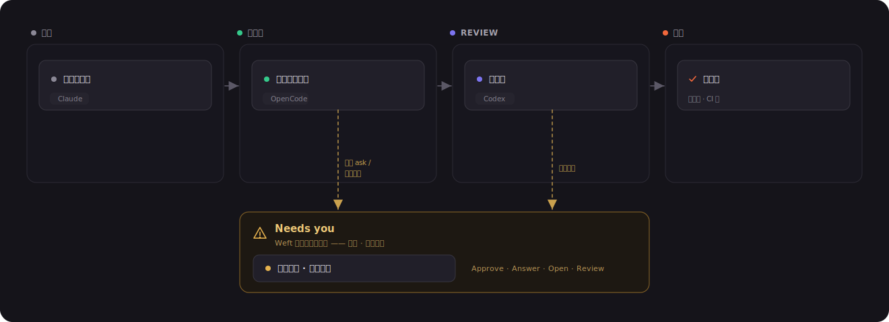

<div align="center">


### 面向 coding agent 的本地优先项目管理、编排中心

丢进一个 Task,收获跨仓 PR —— 编排你自己的 Claude Code、Codex 与 OpenCode,横跨多个仓库。

**本地优先 · 无服务端 · automation-first**

**简体中文** · [English](README.md)

<sub>Tauri v2 · React 19 · Rust · SQLite · xterm.js</sub>

</div>

---

> **Weft** 是一个本地优先、无服务端的桌面交付中心。它让 coding agent(Claude Code、
> Codex、OpenCode)在**多个仓库间并行驱动**工作——从你陈述的一个 **Task**,一路做到
> **干净的 Pull Request**。你给出意图;Weft 负责规划、判定要动哪些仓、拉起 agent、
> 协调它们、验证结果、开出 PR。**你只做监督和处理例外,而不是流程里的必经审批关。**

它明确**不是**终端模拟器,也**不是**"围观 agent 干活"的仪表盘。它是 agent 在其中
完成交付的**工作区与自动化底座**。

<p align="center">
  
  <br><sub><i>Workspace 看板 —— 每个 thread 都是一张活的卡片,展示什么在运行、什么在等你。</i></sub>
</p>

---

## 一张图看懂

一个 workspace 是一组仓库引用的逻辑清单。一个 **Task** 扇出为多个并行的**方向
(direction)**,每个跑在独立的 git worktree 里、由一个 agent 驱动,最终收敛回若干 PR。

<p align="center">
  
</p>

---

## 它凭什么不一样

多数 agent 工具只能聊天,或只驱动**单个**仓。Weft 不可替代的高光时刻是**跨仓 scope
自动分解**:把*一个* Task 变成*"这些仓、这样切分、按这个顺序——谁做什么"*。

| | 多数 agent 工具 | **Weft** |
|---|---|---|
| **工作单元** | 一次对话 / 单个仓 | 跨多仓的一个 **Task** |
| **分解方式** | 你手动拆 | **lead** 基于实时仓库地图推导 scope |
| **隔离** | 单一工作树 | **每个 write 仓一个 git worktree**,懒物化 |
| **人的角色** | 推动每一步 | **监督**;只在例外时介入 |
| **质量门禁** | 人点头 | **可执行验证**(lint · type · test · 契约) |
| **边界** | 无界 | **Task → PR**——merge/CI/release 交给仓库现有 harness |
| **对 agent CLI** | 重新包装 / 代理 | **原生 CLI 原样驱动**——hooks、skills、权限全保留 |

<p align="center">
  
  <br><sub><i>Curator 构建的跨仓依赖图 —— 角色、技术栈、"core · N dependents" —— 这是 scope 分解的燃料。</i></sub>
</p>

---

## 模型

Weft 的结构*本身*就是产品。四个嵌套层级,会话各带一个**角色(role)**:

<p align="center">
  
</p>

<p align="center">
  
  <br><sub><i>家是一个对话:lead 规划并驱动 worker,对各仓只读 —— Board / Lead 标签,原生工具实时运行中。</i></sub>
</p>

- **Curator** 为每个仓产出 Profile(一行定位、接口、技术栈),并构建跨仓依赖图——
  这是 scope 分解的燃料。
- **Lead** 是*家*:一个只读的对话 + 控制塔。它规划、推导 scope、拉起 worker,并通过
  per-thread bus 把它们驱动到收敛。**它从不写代码,也从不吞 worker 的原始 transcript**
  ——worker 回报的是结构化摘要 + diff stat。
- **Worker** 在自己的 worktree 里执行单个方向,拿到结构化 **brief**(scope + 接口契约
  + acceptance)。

---

## 看板 —— 一块活的信任仪表盘

因为没有人做门禁,看板不是一个供你拖动的待办清单,而是 **agent + git + 检查状态
的实时投影**。卡片自己沿生命周期流转;你只对浮上来的那些动手。

它是**两级、缩放联动**的:

- **Workspace 板** —— 每个 **thread** 一张卡,一眼看尽整个组合。每张卡展示它的种类、
  方向数、什么在**运行中**(跳动)、什么**失败了**,以及一个 **needs-you** 徽标。
- **Thread 板** —— 每个**方向 / 任务**一张卡,钻进单条工作线,并用 **Board ↔ Lead**
  标签在卡片与 lead 对话之间切换。

<p align="center">
  
</p>

<p align="center">
  
  <br><sub><i>Thread 看板 —— 方向(direction)沿生命周期排布,每张卡标注它的工具(Claude / Codex / OpenCode)与实时状态;一个待答的 ask 或失败的检查会把卡片叠加进 <b>Needs you</b>。</i></sub>
</p>

- **"Needs you" 是 Weft 拥有的例外车道。** 无论任务存储的状态是什么,一个**待答的
  权限请求**或一个**失败的检查**都会把它叠加进 *Needs you* —— 跨所有 thread 聚合,
  并置顶在每个视图的最上方。没有什么在等你时,它安静地空着。
- **卡片自带 acceptance 信号**(运行中的会话、失败的检查)—— 绿的你信任、红的你打开,
  来源可展开,而不是一个干巴巴的标签。
- **人是动作,不是看护。** 你的动词是 Approve / Answer / Open / Review —— 以及当你想
  推翻 agent 的推断时,把任务在列之间拖动改状态。

---

## 理念(不可违背)

1. **Automation 是北极星。** 默认路径是自治的:Task 进,PR 出。每个界面都为*监督*
   这条流而设计,而不是逐步推动它。
2. **人处理例外,不处理流水线。** Weft **不自加任何审批关**。唯一的阻塞中断来自工具
   自身的权限请求(原样透传,绝不覆盖)以及可配置的不可逆边界。"什么在等我"是罕见
   的例外,被置顶呈现。
3. **驱动原生 CLI,绝不重绘。** 以普通二进制、在用户自己的配置下拉起 `claude` /
   `codex` / `opencode`——保全 hooks、skills、权限。原生 TUI 原样跑在 PTY 里,Weft 只
   *为它装框*。
4. **跨仓接线只是临时的。** 兄弟仓通过临时启动参数(`--add-dir`)只读挂载,绝不写进
   canonical 仓的受控配置。
5. **隐藏机制,呈现决策。** worktree / PTY / MCP bus / sidecar 退到 **Inspect**。Task、
   scope、分支/PR/diff、工具选择、brief 留在台前——每个抽象都配真实逃生舱。
6. **第一天就双语。** 中 / 英,两层——UI 文案*和* agent 产出语言。内部状态枚举保持
   英文;代码 / 标识符始终英文。

---

## 架构

<p align="center">
  
</p>

**锁定技术栈** —— Tauri v2(Rust + React/TS/Vite)· PTY 用 `portable-pty` +
`xterm.js` · 状态用 SQLite(sea-orm)· git worktree 直接调用系统 `git` · i18n 用
`react-i18next`。

---

## 快速开始

> **前置依赖:**[Node.js](https://nodejs.org) 18+、[Rust 工具链](https://rustup.rs),
> 以及 [Tauri v2](https://v2.tauri.app/start/prerequisites/) 的平台依赖。要真正驱动
> agent,还需安装 [Claude Code](https://claude.com/claude-code)、
> [Codex](https://github.com/openai/codex) 或 [OpenCode](https://opencode.ai) 中的
> 一个或多个 CLI。

```bash
# 安装前端依赖
npm install

# 以 dev 模式跑桌面应用(Vite + Tauri)
npm run tauri dev

# 构建 release 包
npm run tauri build
```

不带 Rust 外壳、只迭代前端:

```bash
npm run dev        # Vite 开发服务器
npm run build      # 类型检查 + 生产构建
```

后端测试:

```bash
cd src-tauri && cargo test
```

---

## 目录结构

```
src/                  React 前端
  board/              两级看板、仓库图、scope 确认、needs-you、bus
  session/            lead tab、transcript、diff 视图
  panels/             xterm.js 终端面板
  nav/  components/    workspace 导航、对话框、UI 基件、Inspect
  i18n/               en / zh 资源 + 运行时切换
src-tauri/src/        Rust 后端
  drivers/            ToolDriver:claude · codex · opencode + sidecar 解析
  pty.rs              PTY 会话 + 输入仲裁
  roles/curator/lead  survey · scope · brief · dispatch · worker mandate
  bus/                thread bus(MCP / axum server)+ coordinator 注入
  materialize.rs      scope → worktree + add-dir 接线
  store/              SQLite schema + 仓储
ARCHITECTURE.md       完整设计与可行性研究
PRODUCT.md  DESIGN.md 产品立意与视觉系统
```

---

## 状态

Weft 处于**活跃开发**中。[`CLAUDE.md`](CLAUDE.md) 中定义的垂直切片——单工具端到端
(M1)、worktree 编排 + 数据模型(M2)、三家 driver + surface(M3)、会话交互层(M4)、
lead/worker + 懒物化 scope(M5),以及两级 agent-first 看板 + 配置下发 + i18n(M6)——
已实现或进行中。当前重心是把 scope 简化为无标签、懒物化的模型。

深度设计见 [`ARCHITECTURE.md`](ARCHITECTURE.md);产品立意见 [`PRODUCT.md`](PRODUCT.md);
视觉系统见 [`DESIGN.md`](DESIGN.md)。

---

<div align="center">
<sub>沉静、精确、安静地鲜活。—— Weft</sub>
</div>
