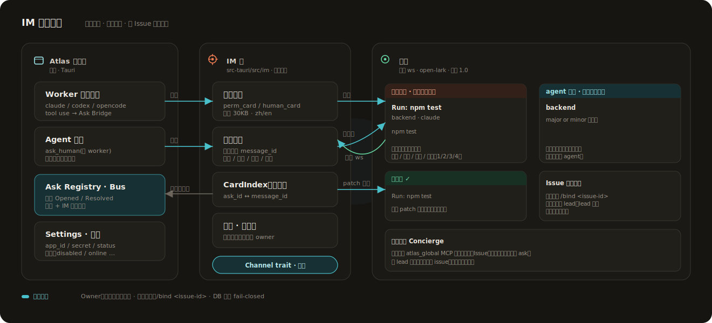

<div align="center">
  

### 本地优先的 Coding Agent 交付工作台

把 feature、bugfix 或 refactor 交给 Atlas。Lead agent 会把目标拆成明确写入范围的
worker 通道；Atlas 为每个确认过的通道物化独立 `git worktree`，再驱动 Claude Code、
Codex 或 OpenCode 推进到可 review 的 diff。

<sub>Tauri v2 · React 19 · Rust · SQLite · native coding-agent CLIs</sub>

[English](README.md)
</div>

<p align="center">
  
</p>

## 为什么是 Atlas

Coding agent 最需要的是明确边界、真实仓库上下文，以及清楚的人类交接点。Atlas 把这条链路留在本地：

- 源码留在你的机器上。
- worker 使用你已经登录过的原生 CLI。
- 每个 worker 都有明确的写入仓库和独立 worktree。
- 产品 UI 展示计划、实时会话、权限请求、diff 和 pre-PR checks，而不是把终端当主界面。

核心产品模型很小：

- **Workspace**：一组逻辑仓库，以及仓库画像、规则和工具配置。
- **Issue**：一条面向用户的工作线，可以是 feature、bugfix、refactor 或 spike。
- **子任务（Sub-task）**：一个具体 worker 通道，目前绑定一个写入仓库。
- **Session**：一个原生 agent 会话，绑定到某个 worktree。

内部存储仍用 `thread` 表示 Issue 层，用 `direction` 表示子任务层。面向用户的文档和 UI 统一称为 **Issue** 与 **子任务**。

## 工作流

<p align="center">
  
</p>

1. 在 Workspace 中添加、克隆或创建仓库。
2. 新建 Issue，并和 Lead agent 讨论目标。
3. Lead 提出子任务，包含写入范围、工具选择、原因和执行授权。
4. 你确认哪些写入声明可以创建 worktree。
5. worker 以 headless Claude/Codex/OpenCode 会话运行，并流式进入 Atlas。
6. 你观察进度、回答请求、查看 diff，并在 PR 前运行检查。

## 产品界面

| Workspace 看板 | Issue 看板 |
|---|---|
|  |  |

| Lead 对话 | 仓库地图 |
|---|---|
|  |  |

## 架构

<p align="center">
  
</p>

Rust 后端负责本地 SQLite 状态库、git worktree 生命周期、headless agent 进程、Ask Bridge、本地 MCP bus、IM 桥、skill source 和 sidecar 观测。React 前端负责 Workspace 看板、Issue 看板、Lead 对话、worker session、Observe/Diff、Settings 和 Needs-you 队列。

<p align="center">
  
</p>

## IM 远程指挥

<p align="center">
  
</p>

worker 产生的权限请求和 agent 提问可以镜像到飞书/Lark 交互卡片。移动端回复卡片，会解析到桌面端使用的同一个处理函数；不论在哪一侧回答，两边都会 patch 到同一个终态。

当前桥接覆盖：

- 权限请求与 agent 提问。
- Issue 到飞书话题的路由，让 Lead 消息双向流动；在飞书话题里发送
  `/bind <issue-id>` 即可绑定。
- 基于 `atlas_global` MCP 工具的 Concierge 私聊入口。
- 每次恢复在线时，对待处理 Needs-you 做一次摘要同步。

绑定策略保持保守：首位私聊发送者可以成为 owner，群消息不能触发绑定，DB 错误 fail-closed。

## 当前能力

- Workspace 仓库 add/clone/create，以及确定性 Repo Profile。
- Claude Lead 会话，带 planner MCP 和写入范围确认。
- Lead action card：在对话里添加、克隆或创建仓库。
- Claude Code、Codex、OpenCode worker 会话。
- Atlas 自有 chat timeline，支持排队、打断、resume、slash commands 和附件。
- Ask Bridge 统一展示工具权限请求，支持 Allow、Always、Full、Deny。
- Skill 仓库源：git-backed 同步，支持全局/按 workspace 启用。
- sidecar 观测 Claude jsonl、Codex rollout jsonl 和 OpenCode SQLite。
- 从物化 worktree 展示 diff 和 pre-PR checks。
- Workspace、Issue、子任务重命名和级联删除。
- 中英双语 UI。

尚未产品化：自动创建 PR、受保护分支合并编排、CI/CD 观测、部署编排、团队 marketplace 同步、长期语义 Curator。

## 本地开发

```bash
pnpm install
pnpm dev             # Vite 前端
pnpm build           # TypeScript 检查 + 生产前端 bundle
pnpm preflight:quick # 快速本地 PR 前检查
pnpm preflight       # 完整本地 PR 前检查
pnpm tauri dev       # 完整桌面应用
pnpm tauri build     # release app bundle
cd src-tauri && cargo test
git diff --check
```

推送 PR 分支前先运行 `pnpm preflight`。GitHub 的 `CI` workflow 作为手动触发的跨平台
兜底检查，仅在需要远端 Linux/macOS/Windows 确认时运行；默认 PR 闭环不再等待远端 CI。

## 目录结构

```text
src/
  board/                Workspace 和 Issue 看板
  session/              chat、observe、diff、权限请求
    blocks/             chat timeline 的富块
    useRepoActions.ts   Lead action card 触发的添加/克隆/新建仓库
  components/           共享 React UI
  i18n/                 英文和中文文案
src-tauri/src/
  lead_chat/            headless agent 会话引擎
    sentinels.rs        解析 <atlas:action_card> / <atlas:list_repos/> 控制符
    repo_state.rs       注入到 Lead prompt 的 <repo_state> 快照
  im/                   IM 桥（Channel trait + 飞书适配器，ws + cards）
  store/                SQLite/SeaORM entities 与 migrations
  bus/                  本地 MCP/thread bus + human-ask notifier
  ask.rs                权限 Ask 注册中心（桌面 + IM 同源）
  git.rs                仓库和 worktree 操作
  materialize.rs
assets/
  screenshots/          README 截图
  diagrams/             架构图和模型图
  readme/               README 概览生成图
```

## 设计约束

Atlas 通过结构化的 headless 接口驱动原生 CLI，并渲染自己的产品 UI。正常 chat surface 不引入嵌入式终端/TUI 依赖；终端接管仍作为需要原生 CLI 时的逃生入口保留。
