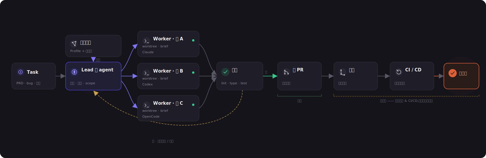
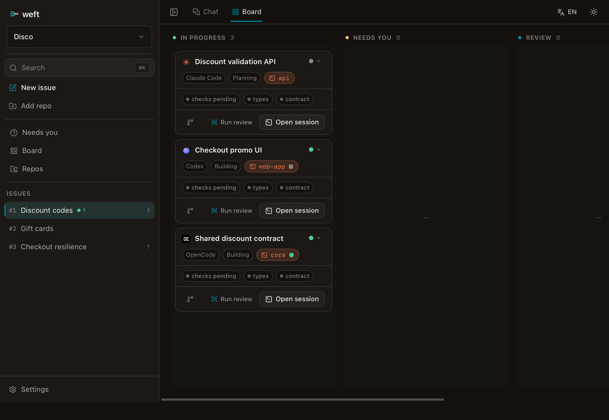
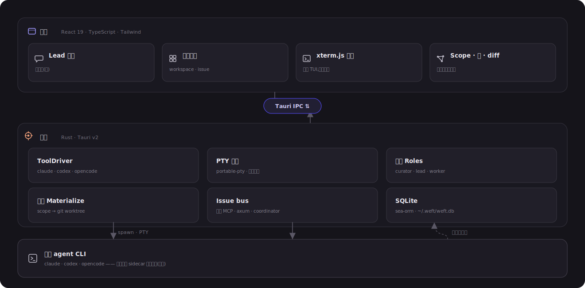
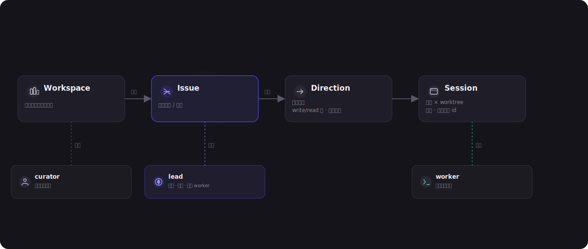

<div align="center">


### 面向 coding agent 的本地优先交付中枢

给 Weft 一个任务。它会规划 scope、启动你的原生 coding-agent CLI、协调隔离 worktree，把多仓工作推进成可评审代码。

**本地优先 · 无服务端 · 原生 CLI · 自动化优先**

**简体中文** · [English](README.md)

<<<<<<< Updated upstream
<sub>Tauri v2 · React 19 · Rust · SQLite · xterm.js</sub>
||||||| Stash base
<sub>Tauri v2 · React 19 · Rust · SQLite</sub>
=======
<sub>Tauri v2 · React 19 · Rust · SQLite · git worktree</sub>
>>>>>>> Stashed changes

</div>

---

<p align="center">
  
  <br><sub><i>Workspace 看板展示活跃 issue、进度、失败检查，以及所有需要人处理的例外。</i></sub>
</p>

## Weft 是什么

Weft 是一个本地桌面应用，用来交付多仓软件任务。它不把“一次 agent 对话”当作工作单元，而是把 **Task** 当作工作单元：bug、PRD、重构、spike 或链接都可以成为 Task，并可能跨多个仓库。

当前产品边界是 **Task → 可评审的本地 worktree diff + 可执行检查**。自动开 PR、观察 CI、合并编排、staging/production 部署仍是路线图。Weft 不重造 CI/CD；它的设计方向是驱动和观测仓库已有流水线。

## 工作方式

<<<<<<< Updated upstream
一个 workspace 是一组仓库引用的逻辑集合。一个 **Task** 会被拆成多个并行的
**direction**。每个 direction 运行在独立的 git worktree 中，由一个 worker agent 执行，最后一起收敛为可评审的结果。当前结果是每个仓库一个 PR；路线图会把这条流程继续延伸到合并和按环境部署。

||||||| Stash base
一个 workspace 是一组仓库引用的逻辑集合。一个 **Task** 会被拆成多个并行的
**direction**。在当前实现里，每个 direction 只拥有一个写入仓库，并对应一个独立的 git
worktree；读取上下文是自由的，不需要声明。多个 direction 最终收敛为可评审的
worktree diff 和可执行检查结果。自动开 PR 是下一阶段交付边界；路线图会把这条流程继续延伸到合并和按环境部署。

=======
>>>>>>> Stashed changes
<p align="center">
  
</p>

1. **Curator** 为仓库建档，并生成依赖图。
2. **Lead** 只读浏览 workspace，提出 scope，并把 Task 拆成 directions。
3. **Worker** 在隔离 git worktree 中执行 direction，每个 direction 只有一个写入仓库。
4. **Checks** 针对变更 worktree 执行；失败检查和权限请求汇总到 **Needs you**。

Weft 以原生二进制方式运行 `claude`、`codex`、`opencode`。它通过结构化 JSON/headless 模式驱动这些工具，保留 hooks、skills 和权限机制，并渲染自己的会话时间线，而不是内嵌终端。

## 产品界面

| Workspace 看板 | Issue 看板 |
|---|---|
|  |  |

<<<<<<< Updated upstream
<p align="center">
  
  <br><sub><i>Curator 构建的跨仓依赖图：仓库角色、技术栈，以及“core · N dependents”等关系，是 scope 拆解的输入。</i></sub>
</p>

---

## 核心模型

Weft 由四个嵌套层级组织而成。每个 session 都有明确角色，让规划、协调和实现保持分离。

<p align="center">
  
</p>

<p align="center">
  
  <br><sub><i>首页是 Lead 对话。Lead 只读浏览各仓库，负责规划工作并驱动 worker。Board / Lead 标签用于在实时看板和协调对话之间切换。</i></sub>
</p>

- **Curator** 为每个仓库生成 Profile，包括仓库角色、接口和技术栈，并据此构建用于拆解任务的跨仓依赖图。
- **Lead** 是主对话和控制塔。它读取仓库、推导 scope、拉起 worker，并通过 thread bus 协调它们。**Lead 不写代码，也不消费 worker 的原始 transcript**；worker 只回报结构化摘要和 diff stats。
- **Worker** 在自己的 worktree 里执行一个 direction，并接收结构化 **brief**，其中包含 scope、接口契约和验收条件。

---

## 看板是信任界面

因为 Weft 不把人放在每一步的门禁上，看板也不是一张需要你反复拖动的待办列表。它实时投影 agent 状态、git 状态和检查状态。卡片会沿生命周期自动流转，你只处理真正浮上来的例外。

看板分两级：

- **Workspace 看板**：每个 **thread** 一张卡，用来查看整个工作区的组合状态。卡片展示任务类型、direction 数量、运行中的工作、失败检查，以及是否有 **Needs you**。
- **Thread 看板**：每个 **direction / task** 一张卡，聚焦一条具体工作线。你可以通过 **Board ↔ Lead** 标签在卡片视图和 Lead 对话之间切换。

<p align="center">
  
</p>

<p align="center">
  
  <br><sub><i>Thread 看板：direction 沿生命周期流转，每张卡标注使用的工具和实时状态；待处理的 ask 或失败检查会把卡片推入 <b>Needs you</b>。</i></sub>
</p>

- **Needs you 是例外通道。** 只要出现待处理的权限请求或失败检查，不管任务本身处于什么状态，都会在这里浮现。它会跨 thread 聚合，并固定展示在每个视图顶部。
- **卡片自带证据。** 运行中的 session、失败检查和验证来源都可以展开查看。绿色应该可信，红色应该可操作。
- **人负责动作，不负责看护。** 主要动作是 Approve、Answer、Open 和 Review。当你想覆盖 agent 的推断时，仍然可以手动拖动卡片调整状态。

---

## 产品原则

1. **自动化是方向。** 默认路径是自治的：Task 进入，代码交付。界面用于监督流程，而不是让人推动每一步。
2. **人处理例外，不处理流水线。** Weft 不额外增加审批关。真正的阻塞来自原生工具的提示，或来自可配置的不可逆操作边界，例如受保护分支合并或生产部署。
3. **运行原生 CLI，不重画它们。** Weft 以普通二进制方式启动 `claude`、`codex` 和 `opencode`，并使用用户自己的配置，保留 hooks、skills 和权限机制。原生 TUI 跑在 PTY 中，Weft 负责承载和编排。
4. **跨仓接线保持临时。** 兄弟仓通过 `--add-dir` 这类启动参数只读挂载；Weft 不会把这类接线写进 canonical 仓库的配置。
5. **隐藏机制，呈现决策。** worktree、PTY、MCP bus、sidecar 等实现细节归入 **Inspect**。Task、scope、分支、PR、diff、工具选择和 brief 才是主界面的一等信息。
6. **从第一天起支持双语。** UI 文案和 agent 输出语言都支持语言偏好。内部状态枚举保持英文，代码和标识符也始终使用英文。

---
||||||| Stash base
<p align="center">
  
  <br><sub><i>Curator 构建的跨仓依赖图：仓库角色、技术栈，以及“core · N dependents”等关系，是 scope 拆解的输入。</i></sub>
</p>

---

## 核心模型

Weft 由四个嵌套层级组织而成。每个 session 都有明确角色，让规划、协调和实现保持分离。

<p align="center">
  
</p>

<p align="center">
  
  <br><sub><i>首页是 Lead 对话。Lead 只读浏览各仓库，负责规划工作并驱动 worker。Board / Lead 标签用于在实时看板和协调对话之间切换。</i></sub>
</p>

- **Curator** 为每个仓库生成 Profile，包括仓库角色、接口和技术栈，并据此构建用于拆解任务的跨仓依赖图。
- **Lead** 是主对话和控制塔。它读取仓库、推导 scope、拉起 worker，并通过 thread bus 协调它们。**Lead 不写代码，也不消费 worker 的原始 transcript**；worker 只回报结构化摘要和 diff stats。
- **Worker** 在自己的 worktree 里执行一个 direction，并接收结构化 **brief**，其中包含 scope、接口契约和验收条件。

---

## 看板是信任界面

因为 Weft 不把人放在每一步的门禁上，看板也不是一张需要你反复拖动的待办列表。它实时投影 agent 状态、git 状态和检查状态。卡片会沿生命周期自动流转，你只处理真正浮上来的例外。

看板分两级：

- **Workspace 看板**：每个 **thread** 一张卡，用来查看整个工作区的组合状态。卡片展示任务类型、direction 数量、运行中的工作、失败检查，以及是否有 **Needs you**。
- **Thread 看板**：每个 **direction / task** 一张卡，聚焦一条具体工作线。你可以通过 **Board ↔ Lead** 标签在卡片视图和 Lead 对话之间切换。

<p align="center">
  
</p>

<p align="center">
  
  <br><sub><i>Thread 看板：direction 沿生命周期流转，每张卡标注使用的工具和实时状态；待处理的 ask 或失败检查会把卡片推入 <b>Needs you</b>。</i></sub>
</p>

- **Needs you 是例外通道。** 只要出现待处理的权限请求或失败检查，不管任务本身处于什么状态，都会在这里浮现。它会跨 thread 聚合，并固定展示在每个视图顶部。
- **卡片自带证据。** 运行中的 session、失败检查和验证来源都可以展开查看。绿色应该可信，红色应该可操作。
- **人负责动作，不负责看护。** 主要动作是 Approve、Answer、Open 和 Review。当你想覆盖 agent 的推断时，仍然可以手动拖动卡片调整状态。

---

## 产品原则

1. **自动化是方向。** 默认路径是自治的：Task 进入，代码交付。界面用于监督流程，而不是让人推动每一步。
2. **人处理例外，不处理流水线。** Weft 不额外增加审批关。真正的阻塞来自原生工具的提示，或来自可配置的不可逆操作边界，例如受保护分支合并或生产部署。
3. **运行原生 CLI，会话界面由 Weft 自己渲染。** Weft 以普通二进制方式启动 `claude`、`codex` 和 `opencode`，并使用用户自己的配置，保留 hooks、skills 和权限机制。每个 CLI 通过其官方结构化 JSON 流被 headless 驱动，Weft 渲染自己的会话界面；任何会话都可以随时在你自己的终端里接管。
4. **跨仓接线保持临时。** 兄弟仓通过 `--add-dir` 这类启动参数只读挂载；Weft 不会把这类接线写进 canonical 仓库的配置。
5. **隐藏机制，呈现决策。** worktree、headless agent 进程、MCP bus、sidecar 等实现细节归入 **Inspect**。Task、scope、分支、PR、diff、工具选择和 brief 才是主界面的一等信息。
6. **从第一天起支持双语。** UI 文案和 agent 输出语言都支持语言偏好。内部状态枚举保持英文，代码和标识符也始终使用英文。

---
=======
| Lead 对话 | 仓库地图 |
|---|---|
|  |  |
>>>>>>> Stashed changes

## 架构

<p align="center">
  
</p>

<<<<<<< Updated upstream
**锁定技术栈**：Tauri v2（Rust + React / TypeScript / Vite）·
`portable-pty` + `xterm.js` · SQLite（sea-orm）· 系统 `git worktree` ·
`react-i18next`。
||||||| Stash base
**锁定技术栈**：Tauri v2（Rust + React / TypeScript / Vite）·
基于各 CLI 原生 JSON 流的 headless chat 引擎 · SQLite（sea-orm）·
系统 `git worktree` · `react-i18next`。
=======
技术栈保持本地优先：
>>>>>>> Stashed changes

- **前端：** React、TypeScript、Vite、Tailwind、i18next。
- **后端：** Tauri v2、Rust、SeaORM 迁移、SQLite（`~/.weft/weft.db`）。
- **Agents：** Claude Code 长驻 stream-json；Codex 和 OpenCode 每回合 JSON 进程。
- **隔离：** 系统 `git worktree` + 命名空间化分支。
- **观测：** sidecar 只读各工具原生会话存档并归一化事件；同一个原生会话不会出现第二个 writer。

<p align="center">
  
</p>

## 当前能力

- Workspace、repo、issue/thread、direction、session、worktree、message 持久化。
- 仓库 add / clone / create、确定性 repo profile、依赖图可视化。
- Claude stream-json 驱动的 Lead 对话和 planner tools。
- Claude、Codex、OpenCode 共用同一个 chat engine 的 worker 会话。
- Resume、interrupt、终端接管、Codex app link、附件、slash discovery、流式 activity。
- Scope review、write-trigger approval、懒物化 worktree、每个 direction 一个写仓。
- Ask Bridge、Needs-you 聚合、thread bus、sidecar observe、diff view，以及常见技术栈的检查推断。
- zh/en UI 和 agent 输出语言偏好。

## 快速开始

前置依赖：Node.js 18+、Rust、Tauri v2 平台依赖、系统 `git`。如果要运行真实 agent 会话，还需要安装至少一个受支持的 coding-agent CLI。

```bash
npm install
npm run tauri dev
```

常用命令：

```bash
npm run dev              # 只启动前端 Vite server
npm run build            # TypeScript 检查 + 前端生产构建
npm run tauri build      # 构建桌面发布包
cd src-tauri && cargo test
```

## 项目结构

```text
src/                  React 前端
<<<<<<< Updated upstream
  board/              两级看板、仓库图、scope 确认、Needs you、bus
  session/            Lead tab、transcript、diff 视图
  panels/             xterm.js 终端面板
  nav/  components/    workspace 导航、对话框、UI 基础组件、Inspect
  i18n/               en / zh 资源与运行时切换
||||||| Stash base
  board/              两级看板、仓库图、写入 scope review、Needs you
  session/            chat 时间线、composer、observe 与 diff 视图
  nav/  components/    workspace 导航、对话框、UI 基础组件、Inspect
  i18n/               en / zh 资源与运行时切换
=======
  board/              workspace/issue 看板、仓库图、scope review
  session/            lead/worker 时间线、composer、observe、diff
  nav/ components/    shell、settings、command palette、共享 UI
  i18n/               中英文资源
>>>>>>> Stashed changes
src-tauri/src/        Rust 后端
<<<<<<< Updated upstream
  drivers/            ToolDriver: claude · codex · opencode + sidecar 解析
  pty.rs              PTY 会话与输入仲裁
  roles/curator/lead  survey · scope · brief · dispatch · worker mandate
  bus/                thread bus（MCP / axum server）+ coordinator 注入
  materialize.rs      scope → worktree + add-dir 接线
  store/              SQLite schema 与 repository
ARCHITECTURE.md       完整设计与可行性研究
PRODUCT.md  DESIGN.md 产品立意与视觉系统
||||||| Stash base
  lead_chat/          headless chat 引擎：claude stream-json（长驻）、
                      codex exec --json · opencode run --format json（每回合）
  sidecar.rs          读取各工具原生会话存档 → 归一化 observe 事件
  ask.rs              Ask Bridge：权限请求 → Needs-you 卡片 → 决定回流
  planner.rs          Task → proposed directions，每个 direction 一个写仓
  curator.rs          确定性 repo profile + 依赖图
  coordinator.rs      bus wakeup → 不进时间线的排队 nudge
  brief.rs            基于 task、仓库图、mandate 生成 worker brief
  check.rs            推断 lint/type/build/test/contract 检查
  config.rs           Claude skills/rules 有效配置预览
  bus/                thread bus（MCP / axum server）+ coordinator 唤醒
  materialize.rs      已确认写入 direction → 命名空间化 git worktree
  store/              SQLite schema、迁移与 repository
ARCHITECTURE.md       完整设计与可行性研究
PRODUCT.md  DESIGN.md 产品立意与视觉系统
=======
  lead_chat/          headless chat 引擎和协议解析
  store/              SQLite schema、迁移、repository
  bus/                本地 thread bus 和 coordinator nudge
  git.rs              worktree 与 diff 命令
  planner.rs          task scope 与 direction proposal
  curator.rs          repo profile 与依赖图
  sidecar.rs ask.rs   observe sidecar 与权限桥
assets/diagrams/      README 架构图和模型图
assets/screenshots/   README 产品截图
>>>>>>> Stashed changes
```

## 设计边界

- 不添加内嵌终端或 TUI 依赖。终端接管是逃生舱，不是产品界面。
- 不把跨仓接线写进 canonical 仓库。使用临时启动参数、worktree-local ignored 文件或 Weft 托管状态。
- 面向用户的字符串走 i18n。内部枚举和代码标识符保持英文。

<<<<<<< Updated upstream
Weft 处于**活跃开发**中。[`CLAUDE.md`](CLAUDE.md) 中定义的垂直切片已经实现或正在推进：单工具端到端（M1）、worktree 编排和数据模型（M2）、三家 driver 与 surface（M3）、会话交互层（M4）、Lead / Worker 和懒物化 scope（M5）、两级 agent-first 看板、配置下发与 i18n（M6）。当前重点是继续把 scope 简化成无标签、按需物化的模型。

**路线图边界。** 目前交付边界是“每个受影响仓库一个 PR”。更长期的目标是继续推进到自动合并和按环境部署，让“完成”的单位变成已经上线的代码，而不是一个打开的 PR。这是路线图，不是当前行为。

更深入的设计见 [`ARCHITECTURE.md`](ARCHITECTURE.md)、[`PRODUCT.md`](PRODUCT.md) 和 [`DESIGN.md`](DESIGN.md)。

---

<div align="center">
<sub>沉静、精确、安静地鲜活。—— Weft</sub>
</div>
||||||| Stash base
Weft 处于**活跃开发**中。当前代码已经实现了本地桌面壳和一条较完整的垂直切片：

- Tauri v2 + React 19 + SQLite，数据库迁移基于 SeaORM。
- Workspace / repo / thread / direction / worktree / session / lead-message 持久化，支持 add / clone / create repo 和 thread 级级联清理。
- 基于 manifest 的确定性 repo profile 与跨仓依赖图。
- Lead 对话由 Claude stream-json 驱动，并注入 planner MCP 工具。
- Claude、Codex、OpenCode worker 共用 chat engine：Claude 长驻，Codex / OpenCode 每回合进程。
- 支持 worker resume、interrupt、终端接管命令、Codex app link、文件附件、图片处理、slash command 发现、流式 delta 与临时 Activity 行。
- Planner proposal 中每个 direction 声明一个写入仓库、原因和 mandate（`plan+impl` / `impl-only`）；待确认写入声明进入 Needs-you，确认后才物化 worktree。
- Ask Bridge 通过生成 hook / plugin 汇总工具权限请求，支持 Allow / Deny / Always / Full 和全局 Dangerous mode。
- 本地 MCP/HTTP thread bus，支持 human ask、shared state、interface broadcast，以及 coordinator 把 wakeup 作为不可见 nudge 排队送入会话。
- Sidecar 读取 Claude jsonl、Codex rollout jsonl、OpenCode SQLite，并归一化为 Observe 事件。
- 针对 Node、Rust、Go、Python、buf contract 的检查推断；worker 空闲后自动检查，review 通过配置的 skill 在 worker 自己会话中运行。
- 两级看板、repo map、Lead tab、worker session、Observe/Diff、Needs-you、Settings、onboarding、command palette、明暗主题，以及 zh/en UI 和 agent 输出语言偏好。
- 跑飞护栏：wall-clock / idle cap 会强停卡住的 turn 并发出 Needs-you；默认值可在 Settings 或 `WEFT_*` 环境变量里配置。

尚未成为产品行为的部分：自动创建 PR、受保护分支合并、staging/production 部署编排、团队 marketplace 同步、长期语义 Curator agent、完整 CI/CD 观测。

**路线图边界。** 当前代码到达的是可评审的本地 worktree diff 与 pre-PR checks。下一阶段产品边界是 Task → PR；更长期目标是继续推进到自动合并和按环境部署，让“完成”的单位变成已经上线的代码，而不是一个打开的 PR。

更深入的设计见 [`ARCHITECTURE.md`](ARCHITECTURE.md)、[`PRODUCT.md`](PRODUCT.md) 和 [`DESIGN.md`](DESIGN.md)。

---

<div align="center">
<sub>沉静、精确、安静地鲜活。—— Weft</sub>
</div>
=======
更多设计见 [`ARCHITECTURE.md`](ARCHITECTURE.md)、[`PRODUCT.md`](PRODUCT.md)、[`DESIGN.md`](DESIGN.md) 和 [`AGENTS.md`](AGENTS.md)。
>>>>>>> Stashed changes
